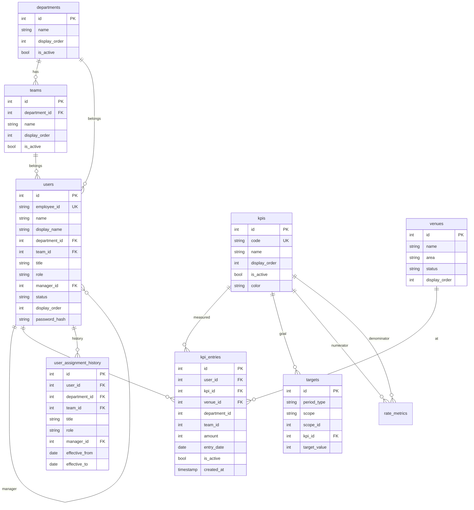

# データベース設計

開発は SQLite、本番は PostgreSQL を想定。スキーマは Knex マイグレーション（`server/src/db/migrations`）で一元管理しています。

## ER図

## テーブル構成

### departments（部署）
| カラム | 型 | 説明 |
|--------|----|------|
| id | int PK | |
| name | string | 部署名 |
| display_order | int | 表示順 |
| is_active | bool | 有効/無効 |
| created_at / updated_at | timestamp | |

### teams（チーム）
| カラム | 型 | 説明 |
|--------|----|------|
| id | int PK | |
| department_id | int FK→departments | 所属部署 |
| name | string | チーム名 |
| display_order | int | 表示順 |
| is_active | bool | 有効/無効 |

### kpis（KPIマスタ）
| カラム | 型 | 説明 |
|--------|----|------|
| id | int PK | |
| code | string UNIQUE | 安定キー（call/seat/negotiation/contract 等）。集計・外部連携に使用 |
| name | string | 表示名（声掛け 等） |
| display_order | int | 表示順（ランキングの主要KPIは最大表示順のもの） |
| is_active | bool | 有効/無効 |
| color | string | UIアクセントカラー |

### venues（会場マスタ）
| カラム | 型 | 説明 |
|--------|----|------|
| id | int PK | |
| name | string | 会場名 |
| area | string | エリア |
| status | string | active/inactive |
| display_order | int | 表示順 |

### rate_metrics（転換率マスタ / 数値項目）
| カラム | 型 | 説明 |
|--------|----|------|
| id | int PK | |
| name | string | 転換率名（例: 受注率） |
| numerator_kpi_id | int FK→kpis | 分子KPI |
| denominator_kpi_id | int FK→kpis | 分母KPI |
| display_order | int | 表示順 |
| is_active | bool | 有効/無効 |

転換率 = `SUM(分子KPI) ÷ SUM(分母KPI)`。集計結果に計算済みで付与される。

### users（営業担当/責任者/管理者）
| カラム | 型 | 説明 |
|--------|----|------|
| id | int PK | |
| employee_id | string UNIQUE | 社員ID（ログインID） |
| name | string | 氏名 |
| display_name | string | 表示名 |
| department_id | int FK | 部署 |
| team_id | int FK | チーム |
| title | string | 役職（自由記述） |
| role | string | 権限 sales/manager/admin |
| manager_id | int FK→users | 責任者 |
| status | string | 在籍状態 active/inactive |
| display_order | int | 表示順 |
| password_hash | string | bcrypt ハッシュ |

### user_assignment_history（所属履歴）
異動（部署/チーム/役職/権限/責任者の変更）時に自動で1行追加し、`effective_to` で期間を管理。将来の期間別集計・異動追跡に対応。

### targets（目標マスタ）
| カラム | 型 | 説明 |
|--------|----|------|
| id | int PK | |
| period_type | string | daily / monthly |
| scope | string | overall / department / team / user / venue |
| scope_id | int NULL | scope に対応する対象ID（overall は NULL） |
| kpi_id | int FK | 対象KPI |
| target_value | int | 目標値 |

`(period_type, scope, scope_id, kpi_id)` に UNIQUE 制約。**目標の解決順**は
営業画面 = `user → department → overall`、ダッシュボード = `department（責任者）→ overall`。

### kpi_entries（KPI入力データ）
| カラム | 型 | 説明 |
|--------|----|------|
| id | int PK | |
| user_id | int FK | 入力者 |
| kpi_id | int FK | KPI |
| venue_id | int FK NULL | 会場 |
| department_id | int | **入力時点の所属スナップショット**（異動後も過去集計が安定） |
| team_id | int | 同上 |
| amount | int | 件数（常に1） |
| entry_date | date | 業務日 YYYY-MM-DD |
| is_active | bool | Undo で false（論理削除） |
| created_at | timestamp | 時間帯別集計に使用（ローカル時刻で保存） |

**設計上のポイント**
- 1タップ = 1レコード。Undo は `is_active=false` にするだけで履歴を残す。
- 集計は `SUM(amount) WHERE is_active=1`。
- 所属をスナップショットするため、担当者が異動しても過去の部署別集計は変化しない。
- インデックス: `(entry_date, is_active)`, `(user_id, entry_date)`, `(kpi_id, entry_date)`。
